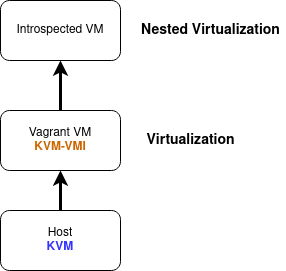
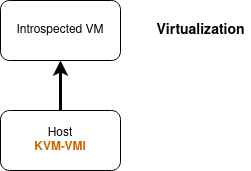

# Setup

## Cloning the sources

First let's make sure that we have the repository, on the right branches.

If you **haven't** cloned `KVM-VMI` yet, use the following command:
~~~
$ git clone https://github.com/KVM-VMI/kvm-vmi.git --recursive
~~~

~~~
$ cd kvm-vmi
$ git checkout master
$ git submodule update
~~~

This setup will help you configure 3 components:
- `KVM`
- `QEMU`
- `LibVMI`

## Option 1: Vagrant - Virtual Machine based setup

This guide will help you setup a `KVM-VMI` development environment,
contained in a virtual machine, on KVM.

[Vagrant](https://www.vagrantup.com/) is a tool that helps create reproductible dev environment.
A Vagrant setup is available for KVM-VMI, and it will configure and install all the components
as well as a test virtual machine for you.

Go to `kvm-vmi/vagrant` and follow the instructions there.

Otherwise, keep reading

## Option 2: Bare-metal setup

This guide will help you setup `KVM-VMI` directly on your system.

### KVM

You will have to compile and install an entire kernel.
It is not possible to compile the KVM modules using an "out-of-tree" build.

First we need to install the kernel build dependencies
~~~
$ sudo apt-get install bc fakeroot flex bison libelf-dev libssl-dev ncurses-dev
~~~

Let's configure the kernel
~~~
$ cd kvm-vmi/kvm
$ make olddefconfig
$ make menuconfig
~~~

Apply the following configuration:
~~~
CONFIG_KVM=m
CONFIG_KVM_INTEL=m
CONFIG_KVM_AMD=m
CONFIG_KSM=n
CONFIG_REMOTE_MAPPING=y
CONFIG_KVM_INTROSPECTION=y
~~~

Build and install the kernel
~~~
$ make -j4 bzImage
$ make -j4 modules
$ sudo make modules_install
$ sudo make install
~~~

Reboot.
Run `uname -a`
You should be on kernel `5.0.0-rc7` (`kvmi v6`)

### QEMU

Dependencies
~~~
$ sudo apt-get install libpixman-1-dev pkg-config zlib1g-dev libglib2.0-dev dh-autoreconf libspice-server-dev
~~~

Configure, build and install QEMU
~~~
$ cd kvm-vmi/qemu
$ ./configure --target-list=x86_64-softmmu --enable-spice --prefix=/usr/local
$ make -j4
$ sudo make install
~~~

Your modified QEMU has been installed at `/usr/local/bin/qemu-system-x86_64`

Note: You might need to modify your **Apparmor** configuration to allow its execution.

### Preparing a domain

The Virtual Machine should be available in `libvirt`. 
Modify the XML configuration as the following.

~~~XML
<domain type='kvm' xmlns:qemu='http://libvirt.org/schemas/domain/qemu/1.0'>
  <qemu:commandline>
      <qemu:arg value='-chardev'/>
      <qemu:arg value='socket,path=/tmp/introspector,id=chardev0,reconnect=10'/>
      <qemu:arg value='-object'/>
      <qemu:arg value='introspection,id=kvmi,chardev=chardev0'/>
  </qemu:commandline>
  ...
  <devices>
      <emulator>/usr/local/bin/qemu-system-x86_64</emulator>
~~~

Note that you need to **add** `xmlns:qemu='http://libvirt.org/schemas/domain/qemu/1.0'`.

Validate the new configuration and start the domain.

### libkvmi

[`libkvmi`](https://github.com/bitdefender/libkvmi) is a wrapper over the low-level KVMi API (ioctls)
You should use this library to build your applications.

~~~
$ git clone https://github.com/bitdefender/libkvmi --branch kvmi-v6
$ ./bootstrap
$ ./configure
$ make
$ sudo make install
~~~

#### Libkvmi examples

Run the example provided by libkvmi: `hookguest-libkvmi`
~~~
$ cd libkvmi/examples
$ ./hookguest-libkvmi /tmp/introspector
~~~

Give it at least `10` seconds (waiting on QEMU to connect to the socket `/tmp/introspector`) and you should see some output ! :tada: 

### LibVMI

[LibVMI](https://github.com/libvmi/libvmi) is a VMI library providing a unified access on `Xen` and `KVM`, as well as a semantic layer.

Dependencies
~~~
$ sudo apt-get install build-essential gcc libtool cmake pkg-config check libglib2.0-dev libvirt-dev flex bison libjson-c-dev
~~~

Build and install
~~~
$ cd kvm-vmi/libvmi
$ mkdir build
$ cd build
$ cmake .. -DCMAKE_INSTALL_PREFIX=/usr/local -DENABLE_KVM=ON -DENABLE_XEN=OFF -DENABLE_BAREFLANK=OFF
$ make -j2
$ sudo make install
~~~

#### JSON profiles

TO use all the features of LibVMI, you need a Rekall/Volatility profile.

You can generate one like this:

1. Run `./examples/vmi-win-guid` and note the `Kernel filename` and `PDB GUID` fields.
2. Use Volatility3 to extract the JSON profile

~~~
$ git clone https://github.com/volatilityfoundation/volatility3
$ cd volatility3
$ virtualenv -p python3 venv
$ source venv/bin/activate
(venv) $ pip install -e .
(venv) $ python volatility/framework/symbols/windows/pdbconv.py -o profile.json -p <Kernel filename> -g <PDB GUID>
~~~

#### Debug output

The debug output can be configured via `CMake`.
The constants should be used from `libvmi/debug.h`

~~~
cd build 
cmake .. -DVMI_DEBUG='(VMI_DEBUG_KVM | VMI_DEBUG_DRIVER)'
make
sudo make install
~~~

Toggling the debug output is controlled by an environment variable: `LIBVMI_DEBUG`

~~~
$ LIBVMI_DEBUG=1 ./build/examples/vmi-process-list -n winxp -j /etc/libvmi/winxp-profile.json
~~~

Go to [LibVMI](https://github.com/libvmi/libvmi) for the rest of the documentation.
