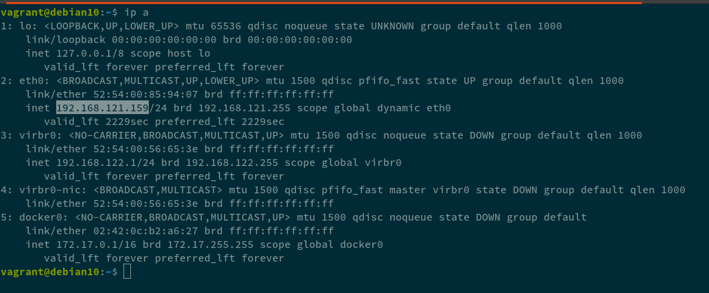
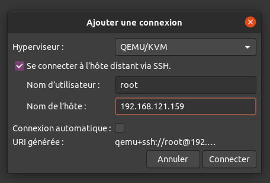
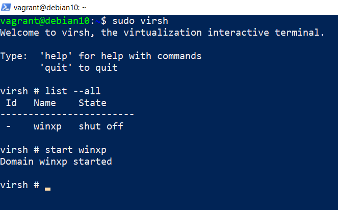
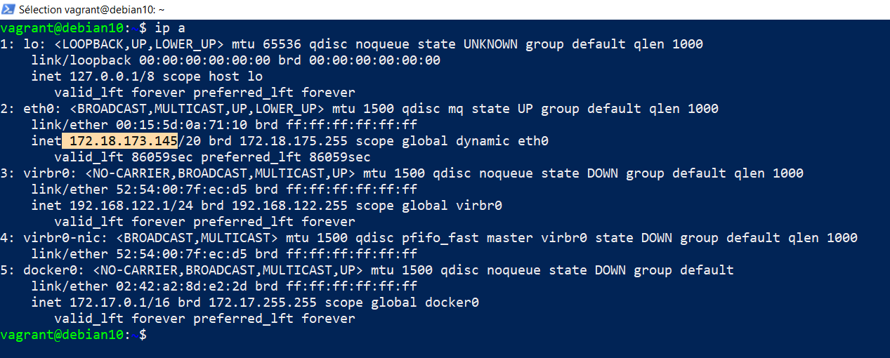
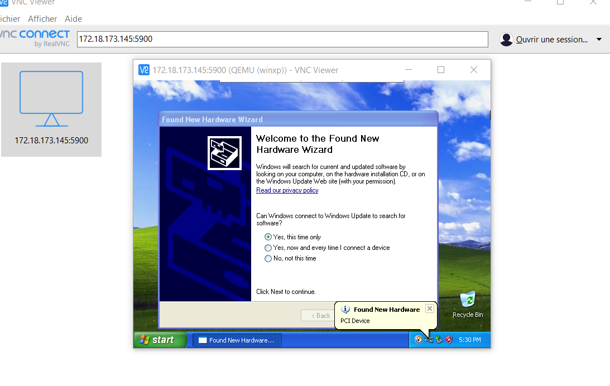
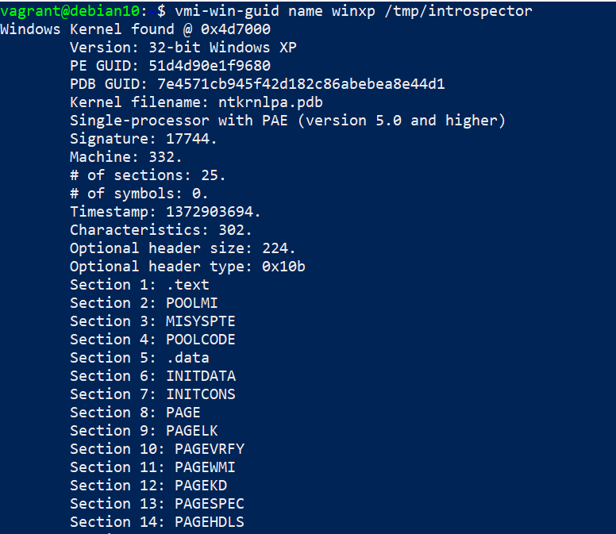
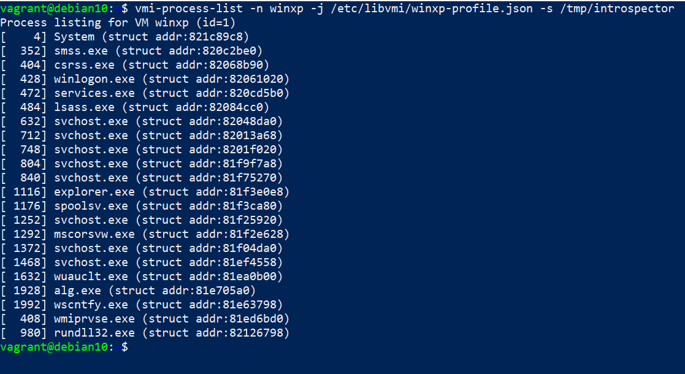
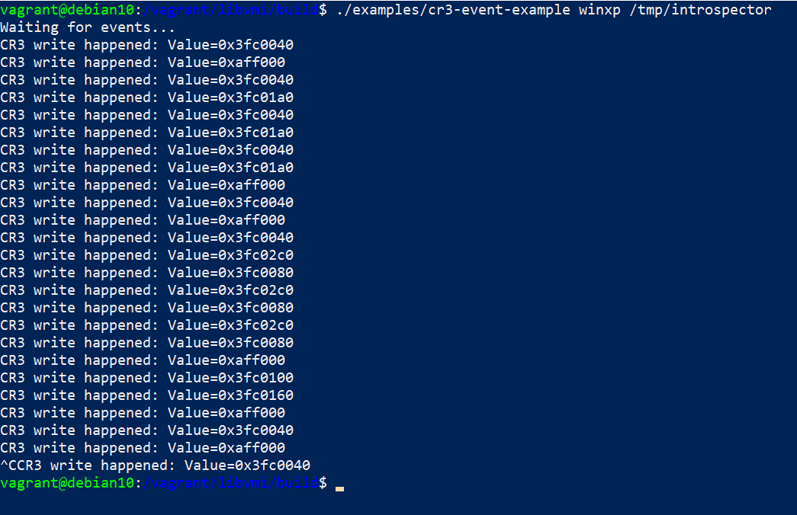

# Setup

This guide will help you setup and configure KVM introspection.

Currently 2 setup methods are supported:

1. Vagrant: contained in a virtual machine (on both Linux and Windows)
2. bare-metal: directly on the host

## Cloning the sources

The first is to clone the main `KVM-VMI` repository:

~~~
$ git clone https://github.com/KVM-VMI/kvm-vmi.git --recursive
~~~

If you have already cloned the repository, the following commands
will make sure that you have the submodules checked out, on the right commits:

~~~
$ cd kvm-vmi
$ git checkout master
$ git submodule update
~~~

⚠️ **Note**: If you are running on Windows, you will not be able to clone the `kvm` submodule.
This is due to a Windows filesystem limitation.
However, you will still be able to setup `KVM-VMI`, by following the `Vagrant` option.

This setup will help you configure 3 components:
- `KVM`
- `QEMU`
- `LibVMI`

## Option 1: Vagrant - Virtual Machine based setup

This guide will help you setup a `KVM-VMI` development environment,
contained in a virtual machine.

[Vagrant](https://www.vagrantup.com/) is a tool that helps create reproductible dev environment.

A Vagrant setup is available for KVM-VMI, and it will configure and install all the components
as well as a test virtual machine for you.

➡️ **Start by installing** [Vagrant](https://www.vagrantup.com/downloads) **for your platform** (Linux or Windows)

⚠️ **Note**: Your Linux distribution might provide a package to install Vagrant.

### Linux Setup

If you are running Linux, Vagrant will use the [libvirt](https://github.com/vagrant-libvirt/vagrant-libvirt) provider
to leverage the `KVM` hypervisor.

**1** Install `vagrant-libvirt` plugin
~~~
sudo apt-get install ruby-dev
vagrant plugin install vagrant-libvirt
~~~

⚠️ **Note**: Your Linux distribution might provide a package to install `vagrant-libvirt`.

**2** Install `vagrant-reload` plugin
~~~
vagrant plugin install vagrant-reload
~~~

### Windows Setup

If you are running Windows, Vagrant will use the [Hyper-V](https://www.vagrantup.com/docs/providers/hyperv) provider.

**1** Install `vagrant-reload` plugin
~~~
vagrant plugin install vagrant-reload
~~~

The next part assumes that you don't have cloned the submodules.
It is not possible to clone the `kvm` submodule on Windows, as it contains
a couple of files that are violating the Windows filesystem naming conventions:

- `drivers/gpu/drm/nouveau/nvkm/subdev/i2c/aux.c`
- `drivers/gpu/drm/nouveau/nvkm/subdev/i2c/aux.h`
- `include/soc/arc/aux.h`

⚠️ **Note**: For more information, please have a look at [MSDN Naming Conventions](https://docs.microsoft.com/en-us/windows/win32/fileio/naming-a-file?redirectedfrom=MSDN#naming-conventions)

**2** Checkout the other submodules

We need to checkout `qemu`, `libvmi` and `libkvmi` submodules

~~~
cd kvm-vmi
git submodule update --init qemu libvmi libkvmi
~~~

### Starting the Vagrant Virtual Machine

**1** Tune the `Vagrantfile` to your needs (CPUs, RAM)

~~~
cd kvm-vmi/vagrant
vim Vagrantfile
~~~

**2** Start the Vagrant VM setup
~~~
vagrant up --provider libvirt           # On Linux
vagrant up --provider hyperv --color    # On Windows (use an elevated powershell)
~~~

**3** Wait, this is going to take a long time (~2h) ☕

### Managing remote VMs

#### Linux - Manage your VMs via virt-manager

On Linux, you can use `virt-manager` to manage the remote VMs in your Vagrant VM.

1. `vagrant ssh` to SSH into the VM
2. `ip a` to get the VM's IP address
    
3. open `virt-manager`
4. File ➡️ Add a connection
5. [x] check _Connect with SSH_
    
6. fill the hostname and click _Connect_
7. answer `yes`
8. password is `vagrant`

You can now manage your remote VMs from `virt-manager`

#### Windows - Manage your VMs

`virsh` will be your main management tool

1. `vagrant ssh`
    
2. `sudo virsh`
3. `list --all`
4. `start winxp`
    
5. `ip a` to get the guest's IP address
    
6. `netstat -ltp | grep qemu` to get QEMU's VNC port
7. Connect with a VNC client to the remote VM !

### Running LibVMI tools

1. `vagrant ssh`
2. Start the VM

Some Libvmi example programs are installed system wide:

You can also run the examples from the `build` directory:

1. Go to `/vagrant/libvmi/build`
2. `./examples/cr3-event-example winxp /tmp/introspector`

🎉

### Troubleshooting

#### Opening the firewall for NFS (Linux)

You need to open your firewall for `NFS`. The following commands should make it work for a `Vagrant` box
to access your host `NFS` server:

~~~
firewall-cmd --permanent --add-service=nfs
firewall-cmd --permanent --add-service=rpc-bind
firewall-cmd --permanent --add-service=mountd
firewall-cmd --reload
~~~

## Option 2: Bare-metal setup

This guide will help you setup `KVM-VMI` directly on your system.

### KVM

You will have to compile and install an entire kernel.
It is not possible to compile the KVM modules using an "out-of-tree" build.

First we need to install the kernel build dependencies
~~~
$ sudo apt-get install bc fakeroot flex bison libelf-dev libssl-dev ncurses-dev
~~~

Let's configure the kernel
~~~
$ cd kvm-vmi/kvm
~~~

You can start from your active config
~~~
$ cp /boot/config-$(uname -r) .config
~~~
or from the default config
~~~
$ make x86_64_defconfig
~~~

Run the menu based program:
~~~
$ make olddefconfig
$ make menuconfig
~~~

Apply the following configuration:
~~~
CONFIG_KVM=m
CONFIG_KVM_INTEL=m
CONFIG_KVM_AMD=m
CONFIG_KVM_INTROSPECTION=y
~~~

Build and install the kernel
~~~
$ make -j$(nproc)
$ sudo make modules_install INSTALL_MOD_STRIP=1
$ sudo make install
$ sudo update-grub
~~~

Reboot.
Run `uname -a`
You should be on kernel `5.4.24+` (`kvmi v7`)

### QEMU

Dependencies
~~~
$ sudo apt-get install libpixman-1-dev pkg-config zlib1g-dev libglib2.0-dev dh-autoreconf libspice-server-dev
~~~

Configure, build and install QEMU
~~~
$ cd kvm-vmi/qemu
$ ./configure --target-list=x86_64-softmmu --enable-spice --prefix=/usr/local
$ make -j4
$ sudo make install
~~~

Your modified QEMU has been installed at `/usr/local/bin/qemu-system-x86_64`

Note: You might need to modify your **Apparmor** configuration to allow its execution.

### Preparing a domain

The Virtual Machine should be available in `libvirt`. 
Modify the XML configuration as the following.

~~~XML
<domain type='kvm' xmlns:qemu='http://libvirt.org/schemas/domain/qemu/1.0'>
  <qemu:commandline>
      <qemu:arg value='-chardev'/>
      <qemu:arg value='socket,path=/tmp/introspector,id=chardev0,reconnect=10'/>
      <qemu:arg value='-object'/>
      <qemu:arg value='introspection,id=kvmi,chardev=chardev0'/>
  </qemu:commandline>
  ...
  <devices>
      <emulator>/usr/local/bin/qemu-system-x86_64</emulator>
~~~

Note that you need to **add** `xmlns:qemu='http://libvirt.org/schemas/domain/qemu/1.0'`.

Note: If you want to use the remote memory mapping feature (and setup a VM with the introspection tool) you'll find detailed instructions [here](https://hvmi.github.io/blog/2020/08/10/getting-started-on-kvm.html).

Validate the new configuration and start the domain.

### libkvmi

[`libkvmi`](https://github.com/bitdefender/libkvmi) is a wrapper over the low-level KVMi API (ioctls)
You should use this library to build your applications.

~~~
$ cd kvm-vmi/libkvmi
$ ./bootstrap
$ ./configure
$ make
$ sudo make install
~~~

#### Libkvmi examples

Run the example provided by libkvmi: `hookguest-libkvmi`
~~~
$ cd libkvmi/examples
$ ./hookguest-libkvmi /tmp/introspector
~~~

Give it at least `10` seconds (waiting on QEMU to connect to the socket `/tmp/introspector`) and you should see some output ! :tada: 

### LibVMI

[LibVMI](https://github.com/libvmi/libvmi) is a VMI library providing a unified access on `Xen` and `KVM`, as well as a semantic layer.

Dependencies
~~~
$ sudo apt-get install build-essential gcc libtool cmake pkg-config check libglib2.0-dev libvirt-dev flex bison libjson-c-dev
~~~

Build and install
~~~
$ cd kvm-vmi/libvmi
$ mkdir build
$ cd build
$ cmake .. -DCMAKE_INSTALL_PREFIX=/usr/local -DENABLE_KVM=ON -DENABLE_XEN=OFF -DENABLE_BAREFLANK=OFF
$ make -j2
$ sudo make install
~~~

#### JSON profiles

TO use all the features of LibVMI, you need a Rekall/Volatility profile.

You can generate one like this:

1. Run `./examples/vmi-win-guid` and note the `Kernel filename` and `PDB GUID` fields.
2. Use Volatility3 to extract the JSON profile

~~~
$ git clone https://github.com/volatilityfoundation/volatility3
$ cd volatility3
$ virtualenv -p python3 venv
$ source venv/bin/activate
(venv) $ pip install -e .
(venv) $ python volatility/framework/symbols/windows/pdbconv.py -o profile.json -p <Kernel filename> -g <PDB GUID>
~~~

#### Debug output

The debug output can be configured via `CMake`.
The constants should be used from `libvmi/debug.h`

~~~
cd build 
cmake .. -DVMI_DEBUG='(VMI_DEBUG_KVM | VMI_DEBUG_DRIVER)'
make
sudo make install
~~~

Toggling the debug output is controlled by an environment variable: `LIBVMI_DEBUG`

~~~
$ LIBVMI_DEBUG=1 ./build/examples/vmi-process-list -n winxp -j /etc/libvmi/winxp-profile.json
~~~

Go to [LibVMI](https://github.com/libvmi/libvmi) for the rest of the documentation.
